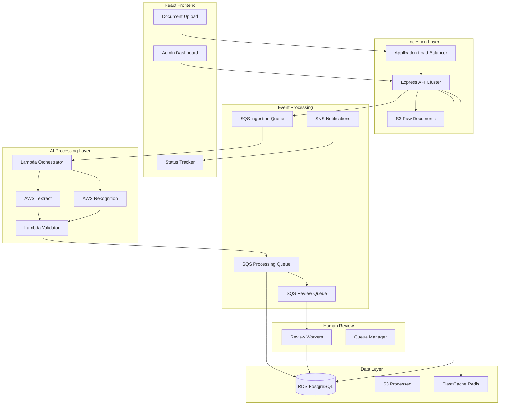
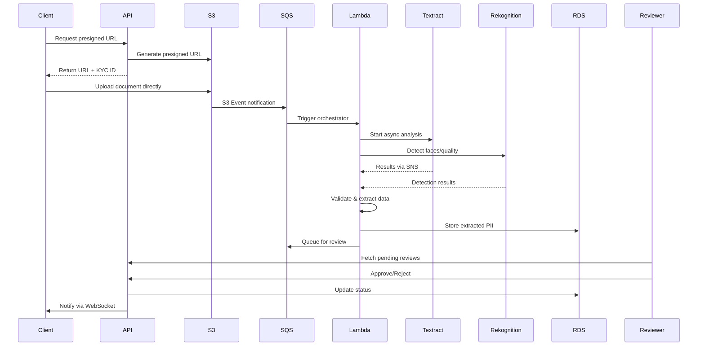

# KYC Client Onboarding System

## Architecture Overview




## Project Structure

```
kyc/
├── frontend/                    # React application
│   ├── src/
│   │   ├── components/
│   │   │   ├── upload/         # Document upload UI
│   │   │   ├── status/         # KYC status tracking
│   │   │   └── admin/          # Admin review dashboard
│   │   ├── services/           # API clients
│   │   ├── hooks/              # Custom React hooks
│   │   └── store/              # State management
│   └── package.json
├── backend/                     # Express/Node API
│   ├── src/
│   │   ├── api/
│   │   │   ├── routes/         # API routes
│   │   │   ├── controllers/    # Request handlers
│   │   │   └── middleware/     # Auth, validation
│   │   ├── services/           # Business logic
│   │   ├── queues/             # SQS producers/consumers
│   │   ├── models/             # Database models
│   │   └── utils/              # Helpers, encryption
│   └── package.json
├── lambdas/                     # AWS Lambda functions
│   ├── document-orchestrator/  # Triggers Textract/Rekognition
│   ├── document-validator/     # Processes AI results
│   └── notification-handler/   # SNS notifications
├── infrastructure/              # IaC (CDK or Terraform)
│   └── aws/
└── docker-compose.yml          # Local development
```

## Scaling Strategy for 10k/sec

### 1. Ingestion Tier

- **ALB** with auto-scaling target tracking (CPU/request count)
- **Express API** on ECS Fargate or EC2 Auto Scaling Group
  - Horizontal scaling: 50+ instances during peak
  - Each instance handles ~200-300 req/sec
- **Presigned S3 URLs** for direct client uploads (bypasses API for file transfer)

### 2. Event Processing Tier

- **SQS Standard Queues** (not FIFO) for throughput
  - Ingestion Queue: receives upload events
  - Processing Queue: receives AI results
  - Review Queue: pending human approvals
- **Dead Letter Queues** for failed processing
- **Batch processing**: Lambda processes 10 messages per invocation

### 3. AI Processing Tier

- **AWS Textract**: Async API with SNS notification
- **AWS Rekognition**: Face detection, document quality
- **Lambda concurrency**: 1000+ concurrent executions
- **Step Functions** for complex orchestration (optional)

## Document Processing Flow




## Data Storage Design

### PostgreSQL Schema (RDS)

```sql
-- KYC submissions
CREATE TABLE kyc_submissions (
    id UUID PRIMARY KEY,
    user_id UUID NOT NULL,
    status VARCHAR(20), -- pending, processing, review, approved, rejected
    document_type VARCHAR(50),
    created_at TIMESTAMP,
    updated_at TIMESTAMP
);

-- Extracted data (encrypted fields)
CREATE TABLE kyc_extracted_data (
    id UUID PRIMARY KEY,
    submission_id UUID REFERENCES kyc_submissions(id),
    field_name VARCHAR(100),
    encrypted_value BYTEA,  -- AES-256 encrypted
    confidence_score DECIMAL,
    created_at TIMESTAMP
);

-- Review queue
CREATE TABLE review_queue (
    id UUID PRIMARY KEY,
    submission_id UUID REFERENCES kyc_submissions(id),
    assigned_to UUID,
    priority INT,
    queued_at TIMESTAMP,
    claimed_at TIMESTAMP
);

-- Audit log
CREATE TABLE audit_log (
    id UUID PRIMARY KEY,
    submission_id UUID,
    action VARCHAR(50),
    actor_id UUID,
    details JSONB,
    created_at TIMESTAMP
);
```

### S3 Bucket Structure

```
kyc-documents-{env}/
├── raw/                    # Original uploads
│   └── {year}/{month}/{submission_id}/
├── processed/              # Textract outputs
│   └── {submission_id}/
└── archived/               # Post-approval retention
    └── {submission_id}/
```

### Encryption Strategy

- **S3**: SSE-S3 or SSE-KMS for at-rest encryption
- **RDS**: AWS KMS encryption for database
- **Field-level**: Application-level AES-256 for PII fields
- **Transit**: TLS 1.3 everywhere

## Key Backend Components

### 1. Upload Controller

- Generate presigned S3 URLs (5-minute expiry)
- Create KYC submission record
- Publish event to SQS

### 2. Document Orchestrator Lambda

- Triggered by S3 event via SQS
- Start Textract async job
- Call Rekognition for face/quality detection
- Store job IDs for correlation

### 3. Document Validator Lambda

- Triggered by Textract completion (SNS)
- Parse extracted fields (name, DOB, passport number, etc.)
- Validate data completeness
- Encrypt and store PII
- Queue for human review if confidence < threshold

### 4. Review API

- Fetch pending reviews with pagination
- Claim/release review assignments
- Approve/reject with audit trail
- WebSocket notifications for status updates

## Frontend Components

### 1. Document Upload

- Drag-drop with file type validation (PNG, PDF)
- Progress indicator with chunked upload
- Real-time status via WebSocket

### 2. Status Tracker

- Timeline view of KYC stages
- Document preview (redacted)
- Estimated completion time

### 3. Admin Dashboard

- Review queue with filters (priority, age, type)
- Side-by-side: document view + extracted data
- Approve/reject with reason
- Analytics: throughput, approval rates, SLA

## AWS Services Summary


| Service           | Purpose          | Configuration                          |
| ----------------- | ---------------- | -------------------------------------- |
| S3                | Document storage | Encryption, lifecycle policies         |
| SQS               | Event queues     | Standard queues, DLQ, 14-day retention |
| SNS               | Notifications    | Textract completion, user alerts       |
| Lambda            | Processing       | 1024MB, 5min timeout, VPC              |
| Textract          | OCR/extraction   | Async API, AnalyzeDocument             |
| Rekognition       | Face detection   | DetectFaces, quality analysis          |
| RDS PostgreSQL    | Primary database | Multi-AZ, r6g.xlarge+                  |
| ElastiCache Redis | Caching/sessions | Cluster mode, 3 nodes                  |
| ECS/EC2           | API hosting      | Auto Scaling, spot instances           |
| ALB               | Load balancing   | Target tracking, WAF                   |
| CloudWatch        | Monitoring       | Custom metrics, alarms                 |
| KMS               | Encryption keys  | CMK for PII                            |


## Implementation Phases

### Phase 1: Core Infrastructure

- Project scaffolding (React + Express)
- AWS infrastructure setup (CDK/Terraform)
- S3 buckets with presigned URL generation
- Basic SQS queues

### Phase 2: Document Processing

- Lambda orchestrator for Textract/Rekognition
- Document validator with field extraction
- Encrypted PII storage in RDS
- Event-driven pipeline

### Phase 3: Human Review

- Admin dashboard with review queue
- Claim/release mechanism
- Approval workflow with audit

### Phase 4: Scaling & Polish

- Auto-scaling configuration
- WebSocket real-time updates
- Monitoring and alerting
- Load testing for 10k/sec

